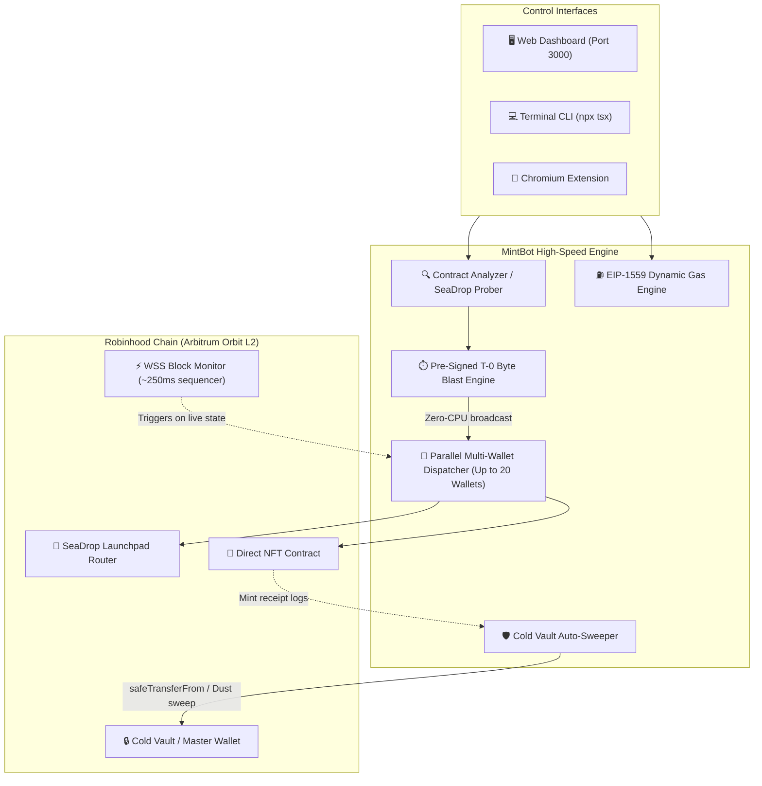

<p align="center">
  
</p>

<h1 align="center">MintBot</h1>

<p align="center">
  <strong>Ultra-low latency NFT minting engine, FCFS drop sniper & multi-wallet suite for Robinhood Chain & OpenSea.</strong>
</p>

<p align="center">
  <a href="#-quick-start"></a>
  <a href="LICENSE"></a>
  <a href="https://www.typescriptlang.org/"></a>
  <a href="https://nodejs.org/"></a>
  <a href="https://robinhood.com"></a>
</p>

<p align="center">
  <a href="#-features">Features</a> •
  <a href="#-quick-start">Quick Start</a> •
  <a href="#%EF%B8%8F-web-dashboard">Web Dashboard</a> •
  <a href="#-cli-commands">CLI Commands</a> •
  <a href="#-browser-extension-setup">Browser Extension</a> •
  <a href="#-architecture--flow">Architecture</a> •
  <a href="#-safety-limits">Safety Limits</a>
</p>

---

## ⚡ System Architecture & Execution Flow



---

## ✨ Features

- 🏎️ **FCFS Sub-100ms Snipe Engine:** Watches contract state and block events via WebSockets (~250ms block times) and launches parallel mint transactions the exact instant sales flip active.
- ⏱️ **Pre-Signed T-0 Byte Blast:** For scheduled drops, pre-computes nonces and signs raw EIP-1559 transaction bytes into memory at $T - 5\text{s}$, broadcasting them with zero CPU latency at $T - 0\text{s}$.
- 🌐 **OpenSea SeaDrop Launchpad Integration:** Automatically detects whether a collection routes through OpenSea SeaDrop (`0x00005EA00Ac477B1030CE78506496e8C2dE24bf5`) and formats parameters automatically.
- 🔍 **On-Chain Contract Analyzer:** Probes contract ABIs, mint signatures (`mint`, `mintPublic`, `mintSeaDrop`, `claim`, `purchase`), public pricing, max limits, and whitelist requirements.
- 👥 **Parallel Multi-Wallet Support:** Dispatches transactions simultaneously across up to 20 burner wallets with independent nonces.
- 💰 **Multicall3 1-Tx Batch Funder:** Distributes native ETH to all burner wallets in a single atomic on-chain transaction from a master funder.
- 🛡️ **Cold Vault Sweeper:** Automatically sweeps newly minted NFTs or remaining native ETH dust back to a secure hardware/cold wallet.
- 🖥️ **Web Dashboard UI:** Full visual control center running at `http://localhost:3000` with live telemetry, wallet management, gas tracker, and drop presets.
- 🧩 **Chromium Extension:** Chrome & Brave popup extension to trigger one-click snipes directly while browsing OpenSea drop pages.

---

## 🚀 Quick Start

### 1. Prerequisites
- **Node.js**: v18.0.0 or higher
- **npm** or **pnpm** / **yarn**

### 2. Installation
```bash
# Clone the repository
git clone https://github.com/Tjay003/mintingBot.git
cd mintingBot

# Install dependencies
npm install
```

### 3. Environment Configuration
```bash
# Copy example configuration template
cp .env.example .env
```

Open `.env` and configure your settings:
```env
# Dedicated burner wallet private key (NEVER your primary vault key)
WALLET_KEY_1=0xabcdef123456...
WALLET_LABEL_1=Burner 1

# (Optional) Additional burner wallets for multi-wallet mints
WALLET_KEY_2=0x...
WALLET_KEY_3=0x...

# (Optional) Master cold wallet address for auto-transfers & sweeping
RECIPIENT_ADDRESS=0xYourColdStorageAddress...

# (Optional) Dedicated Alchemy/QuickNode RPC for lower latency
PRIVATE_RPC_HTTP_URL=
PRIVATE_RPC_WSS_URL=
```

> ⚠️ **SECURITY WARNING:** NEVER use your primary personal crypto wallet. Always generate fresh, temporary burner wallets with only the required ETH amount needed for minting and gas.

---

## 🖥️ Web Dashboard

MintBot includes a browser control panel built with vanilla HTML/CSS/JS and Express WebSocket streaming:

```bash
npm run ui
```

Visit **`http://localhost:3000`** to access:
- **Drop Launchpad:** Paste OpenSea URLs or contract addresses, auto-analyze drop parameters, configure gas multipliers, and fire instant or scheduled mints.
- **FCFS Sniper:** Arm continuous block watchers to snipe drops the moment public sales open.
- **Wallet Manager:** View live ETH and USD balances, add/remove burner wallets, rename labels, batch fund all wallets via Multicall3, and sweep ETH dust.
- **Gas Station:** Real-time Robinhood Chain base fees, priority fee graphs, and custom gas multipliers (`safe`, `fast`, `turbo`).
- **Telemetry Console:** Live streaming transaction logs, confirmation receipts, and Robinhood block explorer links.

---

## 💻 CLI Commands

MintBot can also be run entirely from your terminal:

```bash
# Display CLI help menu
npx tsx src/index.ts --help
```

### 1. Analyze an NFT Contract
Detects mint function signatures, on-chain price, whitelist requirements, and active sale state:
```bash
npx tsx src/index.ts analyze https://opensea.io/collection/spritehood
# or using contract address:
npx tsx src/index.ts analyze 0x1234567890abcdef1234567890abcdef12345678
```

### 2. Check Wallet Balances & Gas
```bash
# Check all burner wallet balances
npx tsx src/index.ts status

# Check current gas prices on Robinhood Chain
npx tsx src/index.ts gas
```

### 3. Public Mint
Fires all configured burner wallets immediately:
```bash
npx tsx src/index.ts mint https://opensea.io/collection/spritehood \
  --quantity 2 \
  --price auto \
  --gas-strategy fast
```

### 4. FCFS Snipe
Monitors the blockchain every block (~250ms) and executes the millisecond the mint goes live:
```bash
npx tsx src/index.ts snipe https://opensea.io/collection/spritehood \
  --quantity 1 \
  --price auto \
  --gas-strategy turbo
```

### 5. Scheduled Mint
Arms a pre-signed T-0 broadcast targeting an exact timestamp:
```bash
npx tsx src/index.ts schedule https://opensea.io/collection/spritehood \
  --time "2026-09-15T18:00:00Z" \
  --quantity 2 \
  --price 0.05 \
  --gas-strategy turbo
```

### 6. Whitelist Mint
Supports on-chain registration, Merkle tree proofs, and ECDSA signatures:
```bash
# Merkle proof WL
npx tsx src/index.ts wl-mint 0xContractAddress \
  --quantity 1 \
  --price 0.02 \
  --proof '["0xabc...","0xdef..."]'

# Signature WL
npx tsx src/index.ts wl-mint 0xContractAddress \
  --quantity 1 \
  --price 0.02 \
  --signature 0x1234abcd...
```

### 7. 1-Tx Batch Wallet Funding & Sweeping
```bash
# Fund all burner wallets with 0.005 ETH each in 1 Multicall3 transaction
npx tsx src/index.ts fund 0.005

# Sweep all remaining native ETH dust from burner wallets to recipient address
npx tsx src/index.ts sweep 0xYourColdStorageAddress
```

---

## 🧩 Browser Extension Setup

MintBot comes with an unpacked Chromium extension (Chrome / Brave / Edge):

1. Open `chrome://extensions` in your browser.
2. Enable **Developer mode** (top right toggle).
3. Click **Load unpacked**.
4. Select the `extension/` directory inside this repository.
5. Start the local server (`npm run ui`).
6. Pin the **MintBot Suite** extension icon in your browser toolbar to interact with drops directly from OpenSea pages.

---

## ⚙️ Gas Strategies & Safety Caps

| Strategy | Multiplier | Description |
|:---|:---|:---|
| `safe` | 1.0x Base Fee | Economical; recommended for uncompetitive drops |
| `fast` | 1.5x Base Fee | Standard; recommended for typical public mints |
| `turbo` | 2.5x Base Fee | High priority; recommended for competitive FCFS races |
| `custom` | Custom Gwei | Manually specify exact Gwei with `--gas-price <gwei>` |

### Safety Limits (configured in `.env`)
- `MAX_GAS_PRICE_GWEI`: Refuses transaction broadcast if gas surges above this ceiling.
- `MAX_ETH_PER_MINT`: Maximum ETH spend cap per individual wallet per mint.
- `MAX_TOTAL_ETH`: Maximum cumulative ETH spend across all wallets combined.

---

## 📁 Repository Structure

```
mintingBot/
├── extension/                # Chromium browser extension (Manifest V3)
│   ├── background.js         # Service worker & hotkey handler
│   ├── popup.html/css/js     # Extension popup UI & controller
│   └── manifest.json
├── public/                   # Web dashboard static assets & frontend
│   ├── index.html            # Neobrutalist UI
│   └── icon.jpeg
├── server/                   # Express HTTP API & WebSocket server
│   ├── api/                  # REST endpoints (wallets, analyze, session, gas)
│   ├── ws-emitter.js         # Real-time WebSocket event broadcaster
│   └── index.ts              # Server bootstrap
├── src/                      # Core EVM engine
│   ├── config/               # Robinhood chain definition & .env loader
│   ├── core/                 # Tx builder, parallel dispatcher & block monitor
│   ├── strategies/           # Public, Snipe, Scheduled & Whitelist mint logic
│   ├── utils/                # Contract analyzer, NFT sweeper, logger
│   ├── wallets/              # Wallet manager & Multicall3 funder
│   └── index.ts              # CLI entry point
├── .env.example              # Configuration template
├── CONTRIBUTING.md           # Contributor guide
├── LICENSE                   # MIT License
├── ROADMAP.md                # Feature backlog & decision log
└── package.json
```

---

## 📄 License & Disclaimer

Distributed under the [MIT License](LICENSE).

> **DISCLAIMER:** This software is provided for educational and local research purposes. Blockchain transactions are irreversible. The developers and contributors are not responsible for any financial loss, gas fees incurred, failed transactions, or account compromises. Always verify smart contracts and protect your private keys.
